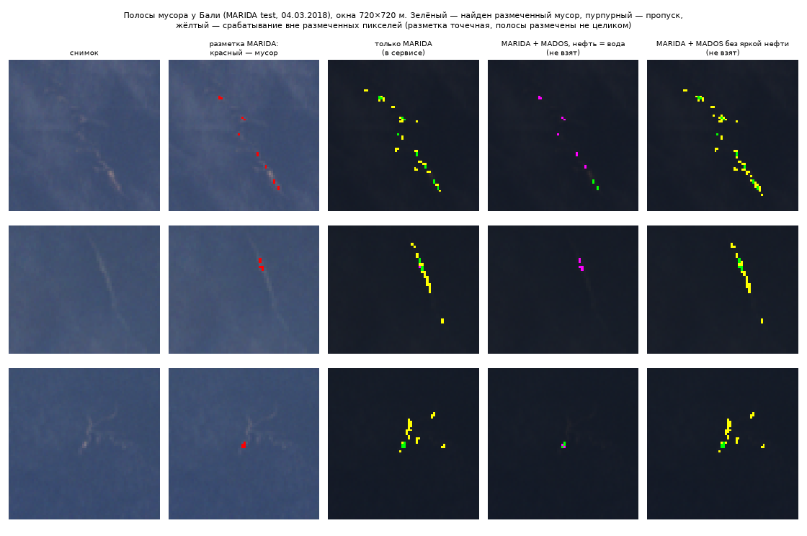
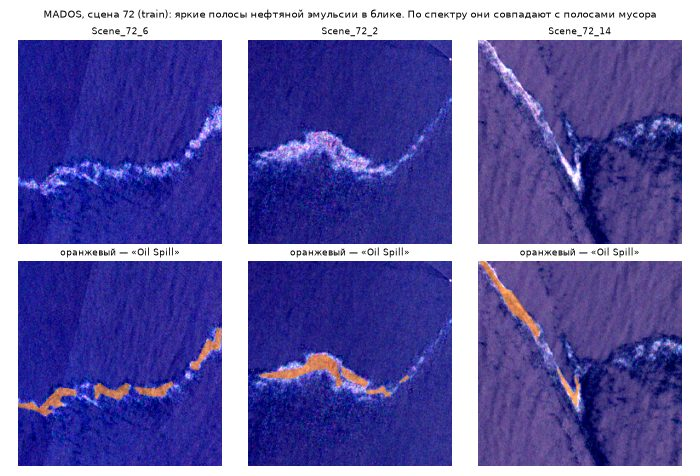
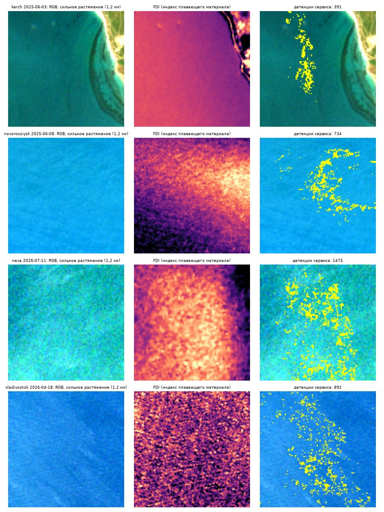

# MADOS: проверка детектора и попытки дообучения

Здесь записано, что мы делали с открытым набором MADOS: что проверили, какие варианты дообучения детектора пробовали,
что они дали и почему модель сервиса осталась прежней. Код — [pipeline/mados.py](../pipeline/mados.py), проверка —
[pipeline/eval_detector_mados.py](../pipeline/eval_detector_mados.py), эксперимент с обучением —
`python -m pipeline.train --with-mados` ([pipeline/train.py](../pipeline/train.py)), тесты —
[tests/test_mados.py](../tests/test_mados.py).

## Итог

- **Детектор сервиса не менялся:** он обучен только на MARIDA.
- **MADOS включает MARIDA целиком** (§2). Новых сцен в нём 111, и по 27 тестовым из них детектор теперь проверяется
  отдельно (`data/eval/detector/mados.json`).
- **На фоне, которого нет в MARIDA, детектор часто ошибается** (§4): на новых сценах MADOS test F1 0,297, за мусор он
  принимает 45,5% пикселей морской слизи и 37,6% медуз.
- **Дообучение на MADOS мы пробовали в трёх вариантах** (§5). Все сильно снижают ложные срабатывания на слизи и нефти,
  но у каждого есть серьёзный минус:

| Вариант | MARIDA test F1 | полнота | MADOS test F1 | слизь | Полосы мусора (Бали, из 41) | На наших снимках |
|---|---:|---:|---:|---:|---:|---|
| **Только MARIDA (в сервисе)** | 0,803 | **0,829** | 0,297 | 45% | **40** | — |
| MARIDA + MADOS, нефть — вода | 0,809 | 0,751 | **0,579** | **4,9%** | 19 | цветение в Невской губе — в 7 раз больше срабатываний |
| MARIDA + MADOS, нефть — отдельная группа | 0,804 | 0,743 | 0,577 | 5,3% | 16 | на всех снимках не проверяли |
| MARIDA + MADOS без яркой нефти | **0,826** | 0,822 | 0,481 | 6,3% | **41** | тысячи ложных срабатываний на плёнках, фронтах и цветении |

Выбрать между ними можно только по разметке наших вод, а её пока нет. Поэтому команда решила оставить прежнюю модель,
а MADOS использовать как проверочный набор. Главный вывод для проекта: **метрики на размеченных наборах не заменяют
проверку на своих снимках** — вариант, лучший на тестах, оказался худшим на наших акваториях.

## 1. Что такое MADOS

MADOS (Marine Debris and Oil Spill) выпустили в 2024 г. авторы MARIDA (Kikaki, Kakogeorgiou, Hoteit, Karantzalos,
*ISPRS Journal of Photogrammetry and Remote Sensing*). Набор лежит на Zenodo
([10.5281/zenodo.10664073](https://doi.org/10.5281/zenodo.10664073), CC BY 4.0, 4 ГБ). Страница проекта —
https://marine-pollution.github.io/.

- 174 сцены Sentinel-2 за 2015–2022 гг., 2 803 патча 240×240 пикселей, официальное разбиение train / val / test.
- 15 классов. Кроме классов MARIDA, есть **нефтяное пятно, нефтяная платформа, морская слизь (Sea snot) и медузы**.
  Облаков и их теней нет.
- Разметка точечная, как в MARIDA: размечена малая часть пикселей, у каждого пикселя есть уверенность разметчика.
- Каналы лежат в исходном разрешении (10, 20, 60 м), отражение после поправки на рэлеевское рассеяние.
- Координат и дат нет: авторы убрали привязку.

Для модели концентрации MADOS ничего не даёт: в нём нет ни счёта предметов на площадь, ни мест и дат для сравнения с
полевыми данными. Он полезен только детектору, как примеры мусора и, главное, **сложного фона, которого нет в
MARIDA**. Для Чёрного моря это как раз нефть (Керченский пролив, терминалы Новороссийска), слизь и медузы.

## 2. MADOS включает MARIDA целиком

Прежде чем что-то обучать, мы сравнили наборы. Для каждой сцены MADOS посчитали число размеченных пикселей каждого
класса и сравнили с каждой сценой MARIDA (классы MARIDA переведены в нумерацию MADOS, `MARIDA_TO_MADOS` в
[config.py](../pipeline/config.py)).

- **Все 63 сцены MARIDA нашлись внутри MADOS.** Число пикселей мусора совпадает до пикселя у всех 63. Расхождение по
  остальным классам не больше 3,4%: в MADOS нет облаков и класса Mixed Water, часть их пикселей размечена иначе.
  Следующая по сходству сцена MARIDA отличается не меньше чем на 20%, так что совпадения однозначны.
- **Разбиение то же:** сцены MARIDA train лежат в MADOS train, val — в val, test — в test.
- **Новых сцен 111** (60 train, 24 val, 27 test), и мусора в них **1 297 пикселей**, а не 4 696, как во всём MADOS.
  Мусор есть в 22 новых сценах, в test — только в 4.

Если сложить MARIDA и MADOS без этой проверки, 3 399 пикселей мусора войдут в выборку дважды. Так, судя по тексту,
сделано в статье Frontiers in Marine Science 2026 г. об объединении двух наборов (там 3 399 + 4 696 = 8 095 пикселей
мусора), поэтому её оценки F1 ≈ 0,90 мы за ориентир не берём.

Проверка — функция `duplicates()` в [mados.py](../pipeline/mados.py) и тест `test_marida_scenes_found_inside_mados`.

## 3. Радиометрия совместима

Отражение в двух наборах посчитано немного по-разному, и это стоило проверить. На размеченной воде пяти сцен,
которые есть в обоих наборах, медианы MADOS выше MARIDA на 0,002–0,006 в канале B01 и до 0,005 в синем B02; в
красном крае, ближнем и коротковолновом ИК разница не больше 0,001 (кроме одной сцены, где в зелёном 0,003). Такой
ровный сдвиг снимает нормализация фона: детектор на копиях сцен MARIDA test внутри MADOS даёт F1 0,811, на самой
MARIDA test — 0,803. Значит, по MADOS можно проверять детектор без пересчёта, а его пиксели можно смешивать с MARIDA.

## 4. Детектор сервиса на новых сценах MADOS

На **27 новых тестовых сценах** (`python -m pipeline.eval_detector_mados`, `data/eval/detector/mados.json`) детектор
даёт P 0,193, R 0,650, F1 0,297 (95% ДИ по сценам 0,02–0,60). На всех 111 новых сценах он нашёл 76% пикселей мусора и
271 из 283 скоплений, но **точность — 0,11**: 8 229 ложных пикселей на 988 верных. Ошибки приходятся на фон, которого
в MARIDA не было:

| Фон | 27 тестовых сцен | Все 111 новых сцен |
|---|---:|---:|
| морская слизь | 45,5% | 38% |
| медузы | 37,6% | 20% |
| редкие водоросли | 4,3% | 3,0% |
| суда | 3,0% | 1,1% |
| нефтяные платформы | 0,84% | 1,9% |
| нефтяное пятно | 0,65% | 1,1% (2 576 пикселей: пятна большие) |

В таблице — доля пикселей класса, принятых за мусор. Для Чёрного моря это прямой риск: слизь и медузы в нём бывают,
нефть — тоже.

## 5. Эксперименты с дообучением

Все варианты обучались тем же кодом и с теми же гиперпараметрами, что и детектор сервиса, на видеокарте (XGBoost,
CUDA). В обучение шли MARIDA train и новые сцены MADOS train, для ранней остановки — val обоих наборов. Test ни
разу не участвовал в обучении. Порог P ≥ 0,5 и фильтры (пена, соседство, CFAR) те же, что в сервисе.

Правило выбора порога записали заранее: максимум F1 на объединённой val (MARIDA val и новые сцены MADOS val).

### 5.1. Все новые сцены, нефть — вода

Всё из MADOS, классы сведены к шести группам детектора (`MADOS_TO_GROUP` в [config.py](../pipeline/config.py)):
слизь, медузы и водоросли — органика; платформы — к судам (яркий неподвижный объект); волны и следы судов — к пене;
нефть, мелководье и мутная вода — к воде. Этот вариант воспроизводит `python -m pipeline.train --with-mados`.

| | MARIDA test F1 (95% ДИ) | точность | полнота | MADOS test F1 (95% ДИ) | слизь | медузы | нефть |
|---|---:|---:|---:|---:|---:|---:|---:|
| Только MARIDA | 0,803 (0,72–0,88) | 0,778 | **0,829** | 0,297 (0,02–0,60) | 45% | 38% | 0,65% |
| Нефть — вода | **0,809 (0,71–0,89)** | **0,877** | 0,751 | **0,579 (0,10–0,74)** | **4,9%** | **31%** | **0,10%** |

Ложных пикселей на MARIDA test стало 40 вместо 90, на MADOS test — 298 вместо 1 613. Но **полнота на MARIDA test
упала на 8 п. п.** Дальше мы искали, куда она уходит и можно ли её вернуть.

### 5.2. Подбор порога

По правилу вышел порог 0,9. Но кривая F1 на val почти плоская: 0,78–0,81 на всём диапазоне 0,15–0,9. Снижение
порога полноту не возвращает (при 0,2 — 0,764 на MARIDA test): у половины потерянных пикселей P < 0,2. Порог
оставили 0,5.

### 5.3. Нефть — отдельная группа

Гипотеза: нефть, отнесённая к воде, «растягивает» воду, и та поглощает слабые пятна мусора. Проверили седьмую группу
«нефть». Полнота не вернулась: MARIDA test F1 0,804, полнота 0,743, MADOS test F1 0,577.

### 5.4. Разбор: полосы мусора у Бали

Потерянные пиксели мы разложили по сценам MARIDA test. Почти вся потеря пришлась на одну сцену — `4-3-18_50LLR`:

| | Остальные 14 сцен: полнота | точность | F1 | Сцена 50LLR: найдено из 41 |
|---|---:|---:|---:|---:|
| Только MARIDA | 0,812 | 0,800 | 0,806 | 40 |
| Нефть — вода | 0,785 | 0,899 | 0,838 | 19 |
| Нефть — отдельная группа | 0,785 | 0,902 | 0,840 | 16 |

На остальных 14 сценах модели с MADOS почти не теряют мусор и заметно точнее. Сцена 50LLR — южный берег Бали
4 марта 2018 г., в разгар сезона мусора. Мусор здесь тянется **длинными тонкими полосами**, а размечены в них
отдельные пиксели: 41 пиксель, из них 29 с низкой уверенностью разметчика, 12 со средней и ни одного с высокой.
Модели с нефтью в обучении от полос оставляют куски и относят их к воде с P ≈ 0,01–0,3.



Для каждого потерянного пикселя мы нашли 15 самых похожих пикселей обучающей выборки по тем же 20 признакам, что
видит модель. **69% соседей — «Oil Spill» из MADOS**, почти все из одной сцены (№ 72, отчасти № 7), остальные — мусор
MARIDA. В сцене 72 нефтью размечены яркие вытянутые полосы в солнечном блике — полосы эмульсии на краю пятна:



По спектру они с полосами мусора Бали почти совпадают (медиана, отражение минус эталон чистой воды):

| | B04 | B08 (ближний ИК) | B8A | FDI | NDVI |
|---|---:|---:|---:|---:|---:|
| Бали, потерянный мусор | 0,014 | 0,022 | 0,018 | 0,036 | 0,04 |
| MADOS, нефть по соседству | 0,015 | 0,024 | 0,012 | 0,036 | 0,04 |

Модель делает то, чему её учили: полосы с таким спектром в MADOS подписаны «не мусор». Это не ошибка кода и не
обязательно ошибка разметки, а **реальная неразличимость по спектру** на разрешении 10 м. Детектор сервиса отмечает
мусором 685 размеченных пикселей сцены 72 (почти все они — нефть), модель «нефть — вода» — 25.

### 5.5. Без яркой нефти: лучше на тестах

Раз яркую нефть и полосы мусора по спектру не различить, мы попробовали не учить модель считать такую нефть водой.
Из обучения убрали нефтяные пиксели, на которых детектор вообще запускается (та же проверка аномалии, что в сервисе:
FDI > 0,01, B08 > 0,01 или B02 > 0,03 над фоном). Это 145 902 из 183 040 нефтяных пикселей train и val (80%).

| | MARIDA test F1 | точность | полнота | Бали, из 41 | MADOS test F1 | слизь | медузы | нефть |
|---|---:|---:|---:|---:|---:|---:|---:|---:|
| Только MARIDA | 0,803 | 0,778 | **0,829** | 40 | 0,297 | 45% | 38% | 0,65% |
| Нефть — вода | 0,809 | **0,877** | 0,751 | 19 | **0,579** | **4,9%** | 31% | **0,10%** |
| Нефть — отдельная группа | 0,804 | 0,876 | 0,743 | 16 | 0,577 | 5,3% | 30% | 0,09% |
| Без яркой нефти | **0,826** | 0,830 | 0,822 | **41** | 0,481 | 6,3% | **27%** | 0,54% |

На тестах этот вариант выглядел лучшим: полосы мусора вернулись, выигрыш по слизи и платформам остался.

### 5.6. Проверка на наших акваториях

Вариант «без яркой нефти» мы поставили и пересчитали им все 208 снимков наших акваторий. Детекций стало резко больше в
Керчи (+525%), Новороссийске (+236%), Невской губе (+178%) и Владивостоке (+78%). Почти весь рост пришёлся на
несколько снимков, и там модель отмечала **размытые пятна**, а не мусор: полосу вдоль границы водных масс (Керчь,
03.06.2025), кольцо, похожее на плёнку от манёвра судна (Новороссийск, 08.06.2025), пятно цветения (Невская губа,
11.07.2026), россыпь по ряби (Владивосток, 18.04.2026). Детектор сервиса почти все эти пиксели считает водой.



Число отмеченных пикселей на этих снимках:

| Снимок | Только MARIDA (в сервисе) | Нефть — вода | Нефть — отдельная группа | Без яркой нефти |
|---|---:|---:|---:|---:|
| Керчь 03.06.2025 | 241 | 561 | 73 | 3 730 |
| Новороссийск 08.06.2025 | 609 | 796 | 180 | 2 719 |
| Невская губа 11.07.2026 | 305 | 2 266 | 233 | 3 692 |
| Владивосток 18.04.2026 | 2 032 | 54 | 25 | 5 383 |

Объяснение: яркая нефть MADOS — это как раз **размытые пятна и плёнки с повышенным FDI**, почти единственные примеры
такого «не мусора» в обучении. Убрав их, мы научили модель считать мусором плёнки, фронты и цветение. На тестах
MARIDA и MADOS этого не видно: таких размеченных пятен там нет.

Остальные варианты на всех наших снимках мы не пересчитывали, только на этих четырёх.

## 6. Решение

Модель сервиса оставлена прежней, обученной только на MARIDA:
- вариант «без яркой нефти» даёт на наших снимках много ложных срабатываний (§5.6);
- варианты «нефть — вода» и «нефть — отдельная группа» теряют полосы мусора (§5.4), а на цветении в Невской губе
  первый срабатывает в 7 раз чаще прежнего;
- без разметки наших вод нельзя честно сказать, какая из моделей там лучше.

Что может изменить решение: разметка набора `python -m pipeline.review sample` (120 зон детекций и 60 контрольных
точек на наших акваториях) и сравнение по ней прежней модели с вариантами «нефть — вода» и «нефть — отдельная группа».
У варианта с отдельной группой есть и дополнительная польза — он умеет показывать нефть отдельно, но качество этого
ещё не проверено.

## 7. Ограничения и оговорки

- **Детектор сервиса** принимает за мусор морскую слизь (45,5% пикселей на MADOS test) и медуз (37,6%). Нефть он не
  ищет: такого класса нет в MARIDA.
- **Оценка на MADOS test неточная.** Мусор есть лишь в 4 из 27 тестовых сцен, поэтому 95% ДИ F1 широкий.
- **Test частично «подсмотрен».** Варианты сравнивали на test обоих наборов, а сцену MARIDA test разбирали отдельно
  (§5.4). На модель сервиса это не влияет: она не менялась.

## 8. Что изменилось в репозитории

- [pipeline/mados.py](../pipeline/mados.py): чтение MADOS прямо из zip, поиск сцен MARIDA внутри MADOS, отбор
  пикселей новых сцен для эксперимента. `python -m pipeline.mados` печатает сводку.
- [pipeline/config.py](../pipeline/config.py): классы MADOS и их сведение к группам детектора.
- [pipeline/eval_detector_mados.py](../pipeline/eval_detector_mados.py): проверка детектора на новых сценах MADOS test
  → `data/eval/detector/mados.json`; шаг добавлен в `pipeline.reproduce`, итог — в [summary.md](summary.md).
- [pipeline/train.py](../pipeline/train.py): флаг `--with-mados` для эксперимента, модель пишется в
  `data/models/xgb_mados.joblib` и не заменяет модель сервиса. Состав обучающей выборки записывается в метаданные.
- `/api/metrics` отдаёт раздел `detector_mados`, в окне «О сервисе» появилась таблица MADOS.

## 9. Как воспроизвести

```bash
curl -L -o data/raw/MADOS.zip "https://zenodo.org/records/10664073/files/MADOS.zip?download=1"   # ~4 ГБ
.venv/Scripts/python -m pipeline.mados                 # сводка: 63 повтора MARIDA, 111 новых сцен
.venv/Scripts/python -m pipeline.eval_detector_mados   # детектор сервиса на новых сценах MADOS test
.venv/Scripts/python -m pipeline.train --with-mados    # эксперимент 5.1 → data/models/xgb_mados.joblib
.venv/Scripts/python -m pipeline.eval_detector_mados --model data/models/xgb_mados.joblib --out mados_exp.json
```

Варианты 5.3 и 5.5 делались скриптами поверх того же кода и в репозиторий не вошли. XGBoost на GPU не вполне
детерминирован, поэтому повторное обучение может дать немного другие деревья.

## Источники

- Kikaki K., Kakogeorgiou I., Hoteit I., Karantzalos K. (2024). Detecting Marine Pollutants and Sea Surface
  Features with Deep Learning in Sentinel-2 Imagery. *ISPRS Journal of Photogrammetry and Remote Sensing*.
  https://www.sciencedirect.com/science/article/pii/S0924271624000625
- Набор MADOS: https://doi.org/10.5281/zenodo.10664073; код и веса MariNeXt: https://github.com/gkakogeorgiou/mados
- Kikaki K. и др. (2022). MARIDA: A benchmark for Marine Debris detection from Sentinel-2 remote sensing data.
  *PLoS ONE* 17(1): e0262247.
- Binary reformulation for marine debris detection in Sentinel-2 imagery… combined MARIDA and MADOS datasets.
  *Frontiers in Marine Science*, 2026. https://doi.org/10.3389/fmars.2026.1765021
